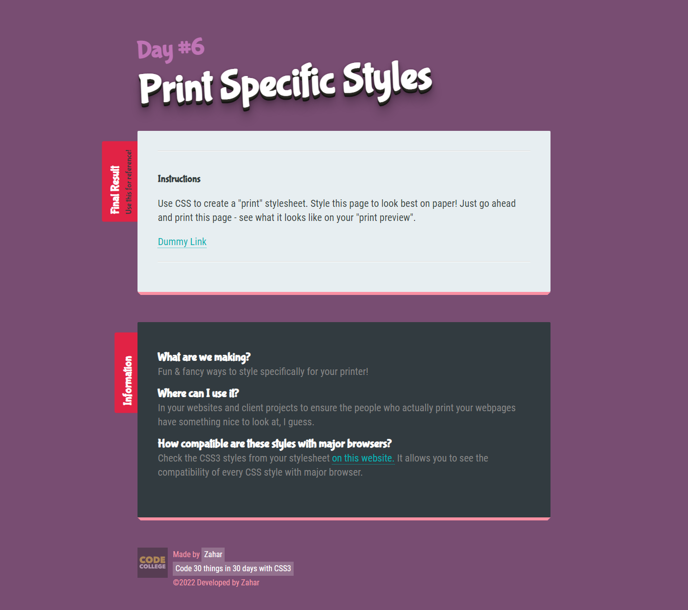
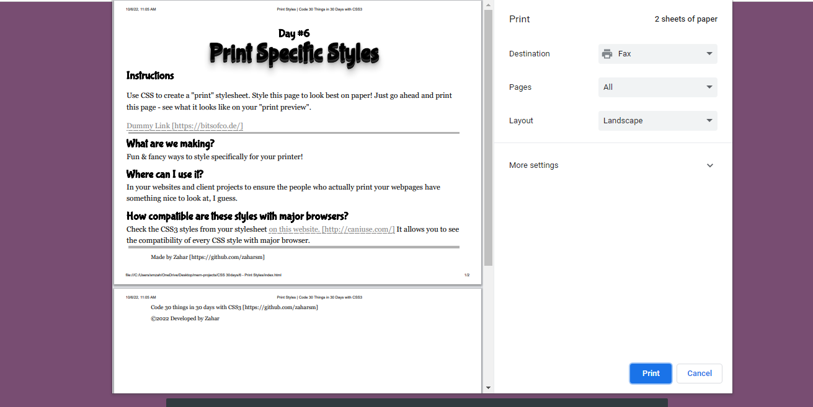

# printstyle-css3

Standard Values considered while printing ===>

       font-family: Georgia, serif;
       font-size: 16pt;
       line-height: 24pt;
       background: none;
       display:none;
       border:none;
       color: #000;

